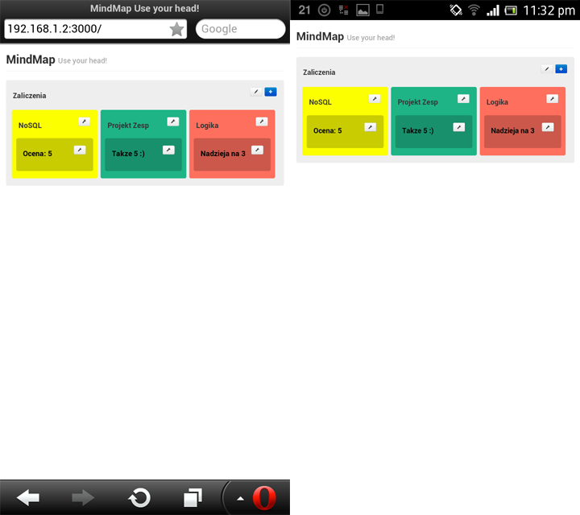

Projekt Zespołowy 2
==

  

Projekt zespołowy - Marta Lewandowska, Tomasz Sott

<h2> Nazwa finalna projektu: MindMap </h2>
Technologie: Aplikacja została napisana w języku JavaScript z wykorzystaniem biblioteki jQuery i jest uruchamiana na serwerze Node.js zainstalowanym pod Windows 7. Aplikacja oparta jest na frameworku Express dla Node.js. Strona graficzna to Bootstrap. Udało się podpiąć pod aplikację bazę danych MongoDB - dane są zapisywane i wczytywane. Aplikacja używa również techonologii socketów co pozwala na korzystanie z aplikacji większej liczbie osób jednocześnie.

Zrzuty ekranu aplikacji działającej na urządzeniach mobilnych (przeglądarki Opera Mobile, Google Chrome, Android Stock Browser):

Przykładowe wpisy

Edycja wybranego pola

[Instalacja NodeJS i uruchomienie aplikacji na systemie Ubuntu](./ubuntu.md)
